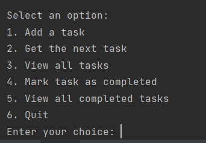
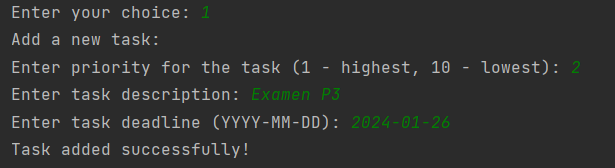
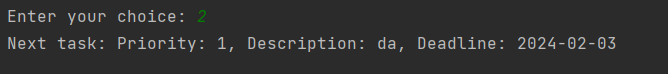
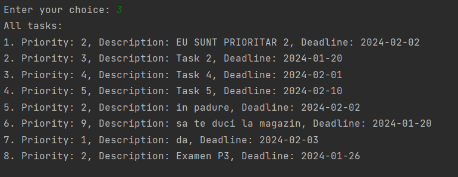
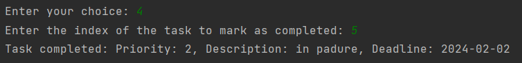
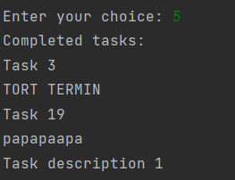

# Task Scheduler

## Description
The **"Task Scheduler"** project is a console-based task management application that uses advanced data structures to ensure efficient and organized functionality. The goal of the project is to provide fast operations for adding, viewing, and marking tasks as completed, without involving a graphical interface.

## Objectives

- Implement efficient task management
- Create an intuitive console interface for the user
- Use advanced data structures to optimize operations
    - Task prioritization
    - Persistent storage of tasks

## Data Structures Used

- **Binomial Heap**: Used for efficient task priority management.
- **B-Tree**: Used for organizing and quickly searching completed tasks.

## Features/Usage Examples
- **Add Task**: The user can add a new task by specifying the priority, description, and deadline through a console interface.
- **Get Next Task**: The user can retrieve the next task based on priorities and deadlines.
- **View Tasks**: A list of all current tasks is displayed in the console.
- **Mark Task as Completed**: The user can mark a task as completed.
- **View Completed Tasks**: The user can view the list of completed tasks.
